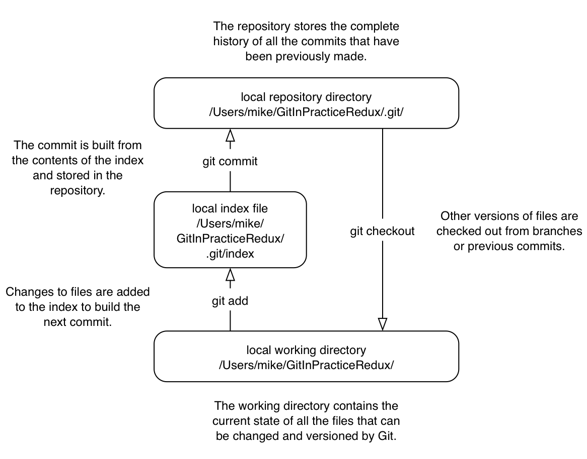
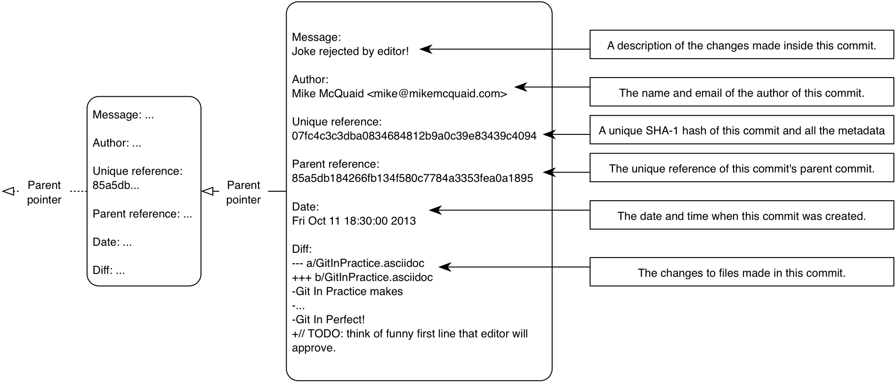
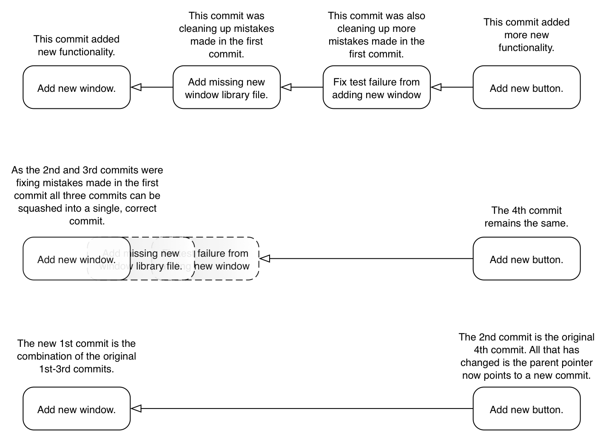
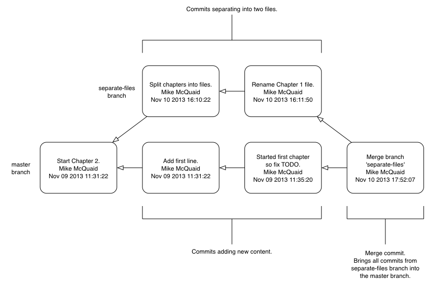
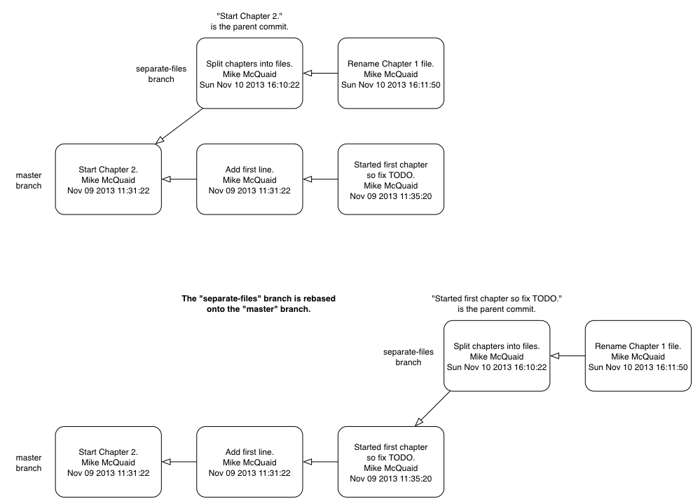

<!-- TODO: Still need to write the intro to Part 1 -->

# Introduction to Distributed Version Control
This chapter covers:

* Why programmers use _version control systems_ to keep track of changes to files over time.
* Adding files to a version control system (_committing_), seeing the differences between versions of files (_diffing_), creating independent tracks of changes (_branching_) and bringing the changes in one track back into another (_merging_).
* Differences between version control systems that store and share changes on a central server (_centralized version control systems_) and those that keep all changes on a local machine and can send and receive them from other machines (_distributed version control systems_).

<!-- TODO: Need a paragraph or two here -->

## Why use version control?
<!-- TODO: Remove undo diagram and move logic into next diagram instead -->


A common problem when dealing with information stored on a computer is handling _changes_. For example, after adding, modifying or deleting text you may want to undo that action (and perhaps redo it later). At the simplest level this might be done by clicking _undo_ in a word processor (which reverts a previous action); after new words are added or formatting changed it may be necessary to undo these changes by pressing undo repeatedly until you return to the desired previous state. At a more advanced level you may also find yourself sharing a document with other people and, rather than just undoing and redoing changes, may also wish to know who made a change, why they made it, when they made it, what the change was and perhaps even store multiple versions of the document in parallel. A _version control system_ (such as Git) allows all these operations and more.


<!-- TODO: Split into two diagrams. Consult email discussion. -->
<!-- TODO: Reference all figures by name -->

A typical method for version control is often simply creating duplicate versions of files with differing filenames and contents (`Important Document V4 FINAL FINAL.doc` may sound sadly familiar). <!-- TODO: Here's where I figure the filesystem half of the comparison figure should go --> Rather than trying to remember differences between the versions and manually making copies each time you could instead put a file (or files) into a version control system (also known as a _revision control system_ or _source control management system_).

In a version control system instead of just saving a document after your changes have been made you would _commit_ it. This involves a save-like operation commanding the version control system to store this particular version and specifying a message stating the reason for their change or what it accomplishes. When another commit is made then the previous version would remain in _history_ where its changes could be examined at a later time. Version control systems can therefore solve the problem of reviewing and retrieving previous changes and allow single files to be used rather than duplicated.

<!-- TODO: Here's where the VCS half of the figure should go. Followed by a short sentence or two comparing how the user then accesses first the current version of the file and then a previous version. -->

###  Version control workflow


Version control systems work by maintaining a list of changes to files over time. Each time a file is modified and committed the difference between the newly committed version of the file and the previous version of the file is stored in the _repository_; a centralized location where the version control system stores files for a particular project. Each commit points to the previous one and stores metadata for a history of the project containing messages, times, authors and difference between files (known as _diffs_). The version control system allows viewing and restoring previous versions of files and returning to the latest at any time. This allows you to have confidence that, no matter what you may add, modify or delete, the older version will always be around if you need to check back on it.

###  Version control for programmer collaboration
Programmers spend most of their jobs (and sometimes their lives) editing text. This text is typically source code which will be interpreted by a computer to perform some task (hopefully better than a human) but could also be software configuration files, documentation, emails or even a dreaded TPS report. As they typically work on independent units of work while in larger teams and can be distributed by time or geography it's important that they communicate explicitly to other programmers why a particular change was made. Additionally programmers inevitably write software which contains _errors_ (or _bugs_, if you're feeling kind, or _errata_ if you're an electronic engineer). When trying to work out why a bug occurred (and hopefully fix it) it's useful to see what changes were made, by whom and for what reason. Often programmers will need to fix bugs in sections of code they did not create so being able to record and recall the intent of the original author at a later point can help understand what faulty assumptions may have caused a bug.


When creating computer software it's also common to release new _versions_ of a product. New versions are generally released when bugs are fixed and/or when new features have been created. However, a team may be half way through developing a new feature but have fixed a bug that they need to provide to users immediately (before the new feature has been completed). In this case two _branches_ could be used to split the history and allow a version containing the bug fix to be immediately released and ensure that none of the changes made while creating a new feature end up in that release. Instead these changes would be made on an independent branch of the history to allow continuous work on the new feature rather than waiting for the bug fix's release to be made. This branch could be later _merged_ into the main branch which would include all the changes into the main branch.

Let's learn more about a version of a file (or files) in a version control system. These are known as _commits_.

## Committing: recording changes to code
<!-- TODO: Annotate right commit and shrink left commit so only contains unique reference and headings? -->


A _commit_ is an collection of changes to one or more files in a version control system. Each commit contains a message entered by the author, details of the author of the commit, a unique commit reference (the format of which varies between version control systems but in Git looks like `86bb0d659a39c98808439fadb8dbd594bec0004d`), a pointer to the preceding commit (known as the _parent commit_), the date the commit was created and the _diff_ (the differences between the files before and the files after the commit).

As you may have noticed the above diagram uses arrows pointing from commits to the one previously. The reason for this is that commits contain a pointer to the _parent commit_ and not the other way round; when a commit is made it has no idea what the next commit will be yet.

A _commit_ is made up of the changes to one or more files on disk. The typical workflow is that you will change the contents of files inside a folder on disk which is managed by Git and, after making all necessary changes, review the _diffs_ and add them to a new commit. Often all the _diffs_ made will turn into one commit and then the cycle will repeat. Sometimes, however, it is desirable to pick only individual changed files (or even individual changed lines within files) to include in a commit and leave the other changes for adding in a future commit. This is often desirable because commits should be the smallest possible units of work to make them easier to understand.

<!-- TODO: rule of thumb about small commits being better and why (into callout) -->

### Commit storage in Git
Git is a version control system built on top of an _object store_. When you commit Git creates and stores a collection of objects inside the object store. This object store is stored inside the Git _repository_. The repository is the local collection of all the files related to a particular Git version control system and is stored in a `.git` folder in the root of the project. If you were to explore under here (as we will do in Chapter 2) you would find objects, various pointers/references to objects and configuration files.

<!-- TODO: annotate diagram further based on paragraph below -->


The main three Git objects we're concerned about are _commits_, _blobs_ and _trees_ (there is also a _tag_ object but we can ignore this for now). We've already seen what commits are and what they store (metadata and a diff) but what do the blob and tree objects store? A blob object stores the contents of a particular version of a particular single file in the Git repository. A tree object stores a reference to all the blob objects at a particular point in time and other tree objects if there are any subfolders.

<!-- TODO: make a callout -->
When using Git you should never need to interact with objects or object files directly. The terminology of _blobs_ and _trees_ are not used regularly in Git or in this book but it's useful to remember what these are so you can build a conceptual understanding of what Git is doing internally. When things go well this should be unnecessary but when we start to delve into more advanced Git functionality or Git spits out a baffling error message then remembering _blobs_ and _trees_ may help you work out what has happened.

Now we've peeked behind Git's abstraction to see how it stores things internally let's return to something very practical: how versions of code change over time.

## History: how code changes over time
The _history_ of a version control system is the complete list of all changes made since the repository was created and the initial commit was made. The history also contains the references to any _branches_, _tags_ (a way of annotating a particular commit with, for example, a version) and _merges_ made within the repository.

Without history version control would be a simple mechanism for file storage. History allows us to analyze the state of a repository at any specific date and time and recall the contents of every file, the person who changed the files, when they changed the files and (if a good commit message has been written) why they changed them.

When you are using version control you will find yourself regularly checking the history; sometimes to remind yourself of your own work, sometimes to see why other changes were made in the past and sometimes reading new changes than have been made by others. In different situations different pieces of data will be interesting but all pieces of data will always be available for every commit.

As you may have got a sense of already: how useful the history is relies very much on the quality of the data entered into it. If I was making a commit once per year with huge numbers of changes and a commit message like "do stuff" then it would be fairly hard to use effectively. Ideally commits are small and well-described; follow these two rules and having a complete history becomes a very useful tool.

### Commits point to their parent commits
Every commit points to its _parent commit_. The parent commit in a linear, branch-less history will be the one that immediately preceded it. The only commit that lacks a parent commit is the _initial commit_; the first commit in the repository. By following the parent commit, its parent, its parent and so on you will always be able to get back from the current commit to the initial commit.

<!-- TODO: add graphic of commits -->

### Rewriting history
Git is unusual compared to many other version control systems in that it allows history to be rewritten. This may seen surprising or worrying; after all did I not just tell you that the history contains the entire list of changes to the project over time? Surely it is dangerous to modify this? The answer to this question is: sometimes. In a history book you may hear about the beginning and end of various historical transitions but not every detail of what occurred in between. Similarly sometimes you may want to highlight only broader changes to files in a version control system over a period of time rather than sharing ever single change that was made in reaching the final state.

<!--TODO: annotate with better captions -->


Here you see a fairly common use-case for rewriting history with Git. If you were working on some window code all morning and wanted your coworkers to see it later (or just include it in the project) then there's no need for everyone to see the mistakes you made along the way; why damage your good reputation unnecessarily? In the diagram the commits are being _squashed_ together so instead of three commits and the latter two fixing mistakes in the first commit we have squashed these together to create a single commit for the window feature. We'd only rewrite history like this if working on a separate branch that hadn't had other work from other people relying on it yet as it has changed some parent commits (so, without intervention, other people's commits may point to commits that no longer exist). Don't worry too much about rebasing or squashing work for now; just this as a situation where you may want to rewrite history. In Chapter 7 we'll cover cases where history rewriting is useful such as rewriting an entire repository to change an email address or removing confidential information before making the history public.

What we're generally interested in when reading the history (and why we clean it up) is ensuring the changes between commits are relevant (for example don't make changes only to revert then immediately in the next commit five minutes later), minimal and readable. These changes are known as _diffs_.

## Diffs: the differences between commits
A _diff_ (also known as a _change_ or _delta_) is the difference between two commits. In a version control system you can typically request a diff between any two commits, branches or tags. It's often useful to be able to request the difference between two parts of the history for analysis. For example, if an unexpected part of the software has recently started misbehaving you may go back into the history to verify that it previously worked. If it did work previously then you may want to examine the diff between the the code in the different parts of the history to see what has changed. The various ways of displaying diffs in version control typically allow you to narrow them down per-file, folder and even committer.

### Default diff format
<!-- TODO: turn into an annotated diagram instead and use more than one file -->
```
diff --git a/README.txt b/README.txt
index a1584ab..6706ce7 100644
--- a/README.txt
+++ b/README.txt
@@ -1 +1 @@
-This software is very unstable.
+This software is very stable.
```

Diffs are typically shown by version control systems in a format that is known as a _unified diff_. This indicates what lines have been changed in what files and details the added or removed lines. The above example shows a change to a `README.txt` commenting on a dramatic change in software quality. You can see that lines that have been removed are prefixed with a `-` and lines that have been added are prefixed with a `+`. Even although these lines are fairly similar and share many words the diff output shows a modified line as being removed and then added with a new contents.

Diffs are used throughout version control systems to indicate changes to files; for example when navigating through history or viewing what you are about to commit. It's important to grasp the format as it will be used throughout this book and when using Git.

### Different diff formats
Sometimes it is desirable to display diffs in slightly differing formats. Two common alternatives to a typical unified diff are a _diffstat_ and _word diff_.

```
README.txt | 2 +-
1 file changed, 1 insertion(+), 1 deletion(-)
```

The above example is a diffstat for the same changes as the previous unified diff. Rather than showing the breakdown of exactly what has changed it indicates what files have changed and a brief overview of how many lines were involved in the changes. This can be useful when getting a quick overview of what has changed without needing all the detail of a normal unified diff.

```
diff --git a/README.txt b/README.txt
index a1584ab..6706ce7 100644
--- a/README.txt
+++ b/README.txt
@@ -1 +1 @@
This software is very [-unstable.-]{+stable.+}
```

A word diff is similar to a unified diff but shows modifications per-word rather than per-line. The above example shows that most of the sentence remained the same except for a few changed words. This is particularly useful when viewing changes that are not to code but plain text; in README files we probably care more about individual word choices than knowing that an entire line has changed and the special characters (`[-]{+}`) are not used as often in prose than in code.

## Branches: working on multiple versions of code in parallel
When committing to a version control system the history continues linearly; what was the most recent commit becomes the parent commit for the new commit. This parenting continues back to the initial commit in the repository. As discussed previously, sometimes this linear approach is not enough for software projects. Sometimes you may need to make new commits which are not yet ready for public consumption. Enter _branches_.

<!--TODO: split graphic into two based on email -->
<!--TODO: 1. middle bottom commit annotation "minor things committed to stable branch" 2. Stable branch or master branch 3. annotate commits in feature branch "new features, experimental refactoring on branch" -->


Branching allows two independent tracks through history to be created and committed to without either modifying the other. Programmers can happily commit to their independent branch without the fear of disrupting the work of another branch. This means that they can, for example, commit broken or incomplete features rather than having to wait for others to be ready for their commits. It also means they can be isolated from changes made by others until they are ready to integrate them into their branch.

When a branch is created and new commits are made that branch advances forward to include the new commits. In Git a branch is actually no more than a pointer to a particular commit. The branch is pointed to a new commit when a new commit is made on that branch. A _tag_ is quite similar to a branch but points to a single commit and remains pointing to the same commit even when new commits are made. Typically tags are used for annotating commits; for example, when you release version 1.0 of your software you may tag the commit used to built the 1.0 release with a "1.0" tag. This means you can come back to it in future, rebuild that release or check how certain things worked without fear that it will be somehow changed automatically.

### Using branching
Branching allows two independent tracks of development to occur at once. In our simple previous example, one developer needed to work on a feature and another on a releasing a bug fix without either interfering with the other's work. At a more advanced level branches will be used more extensively than just one per developer (particularly in version control systems like Git that make creating a branch quick and easy). Some programmers will create <!-- TODO: feature branches diagram --> _feature branches_ whenever they work on a new bug fix or feature and then integrate these branches at a later point; perhaps after requesting review of their changes from others. This means even for programmers working without a team it can be useful to have multiple branches in use at any one point. For example, you may be working on a new feature but realize that a critical error in your application needs fixed immediately. You could quickly create a new branch based off the (hopefully tagged) version used by customers, fix the error and switch branch back to the branch you had been committing the new feature to.

## Merging: bringing the changes from one branch into another
At some point we have a branch that we're done with and we want to bring all the commits made on it into another branch. This process is known as a `merge`.



When a merge is requested all the commits from another branch are pulled into the current branch. Those commits then become part of the history of the branch. Please note that the commit in which the merge is made has two parents commits rather than one; it is joining together two separate paths through the history back into a single one. After a merge you may decide to keep the existing branch around to add more commits to it and perhaps merge again at a later point (only the new commits will need to be merged next time). Alternatively, you could delete the branch and make future commits on the stable branch; perhaps creating a new branch from the stable branch when a new feature needs to be implemented.

### Merge conflicts
So far merges may have sounded too good to be true; you can work on multiple things in progress and combine them at any later point in any order. Not so fast my merge-happy friend; I haven't told you about merge conflicts yet.

A _merge conflict_ occurs when both branches involved in the merge have changed the same file (or the same part of the same file, depending on how smart your version control system is). The version control system will try and automatically resolve these conflicts but sometimes is unable to do so without human intervention. Git can typically merge without conflicts as long as the changes were not too near each other in the same file. If the version control system fails to perform the merge without human intervention it produces a merge conflict.

<!-- TODO: replace with annotated diagram -->
```
<<<<<<<
This software is very unstable.
=======
This software is very stable.
>>>>>>>
```

When a merge conflict occurs the version control system will go through any files that have conflicts and insert something similar to the above markers. These markers indicate the versions of the file on each branch. In the case we were merging the <!-- TODO: add workflow diagram --> "unstable" branch into "stable" then the README might have a merge conflict like the above; the "stable" branch says the software is very stable and the "unstable" branch says it is dangerously stable. The person performing the merge will need to manually edit the file to product the correctly merged output, save it and mark the commit as resolved. Sometimes the correct output will picking a single side of the markers and sometimes it will be a combination of the two.

When conflicts have been resolved a _merge commit_ can be made. This will store the two parent commits and the conflicts that were resolved so they can be inspected in the future. Unfortunately sometimes people will pick the wrong option or merge incorrectly so it's good to be able to later see what conflicts they had to resolve.

### Rebasing
A _rebase_ is a method of history rewriting in Git that is similar to a merge. A rebase involves changing the parent of a commit to point to another.



In this case Seth wanted to rebase his feature branch on top of the current stable branch. He perhaps wanted to do this to include all the bug fixes from the stable branch but did not want to merge. In this case the rebase has changed the parent of the commit from the 2.3 release commit to the 2.4 release commit; anything included in the 2.4 release will now be in the feature branch.

We'll cover rebasing in more detail later in the book. All that's necessary to remember for now is that it's a different approach to a merge that can be used for a similar outcome (pulling changes from one branch into another).

## Remote Repositories: exchanging commits with another computer


Typically when using version control you will want to share your commits (or branches) with other people using other computers. With a traditional, _centralized version control system_ (such as Subversion or CVS) the repository is usually stored on another machine. As you make a commit it is sent over the network, checked that it can apply (there may be other changes since you last checked) and then committed to the version control system where others can see it.

With a _distributed version control system_ like Git every user has a complete repository on their own computer. While there may be a centralized repository that people send their commits to it will not be accessed unless specifically requested. All commits, branches and history are stored offline unless users choose to send or receive commits from another repository.

A repository you send or receive commits to is known as a _remote repository_. You control when these changes are sent or received.

### Communicating with a remote repository
<!--TODO: push/pull workflow diagram -->
Changes are sent to a remote repository in a _push_ operation and received in a _pull_ or _fetch_ operation. When either of these occur your repository talks to the other repository, finds out what you know in common and sends only the differences between the two repositories (obviously with large repositories to do otherwise would be very slow).

### Authoritative version storage
With centralized version control systems the central server always stores the authoritative version of the code. Clients to this repository will typically only store a small proportion of the history and require access to the server to perform most tasks. With distributed version control system like Git every local repository has a complete copy of the data. Which repository stores the authoritative version in this case? It turns out that this is merely a matter of convention; Git itself does not deem any particular repository to have any higher priority than another. Typically in organizations there will be a central location (like with a centralized version control) which is treated as the authoritative version and people are encouraging to push their commits and branches to.

The lack of authority for a particular repository with distributed version control systems is sometimes seen as a liability but can actually be a strength. The Linux kernel project (for which Git was original created) makes use of this to provide a network of trust and a more manageable way of merging changes. When Linus Torvalds, the self-named "benevolent dictator" of the project, tags a new release this is generally considered a new release of Linux. What is in his repository (well, his publicly accessible one; he will have multiple repositories between various person machines that he does not make publicly accessible) is generally considered to be what is in Linux. Linus has trusted lieutenants from who he can pull and merge commits and branches. Rather than every single merge to Linux needing to be done by Linus he can leave some of it to his lieutenants (who leave some to their sub-lieutenants and so on) so everyone can needs only worry about verifying and including the work of a small number of others. This particular workflow may not make sense in many organizations but it demonstrates how distributed version control systems can allow different ways of managing merges to centralized version control.

## Summary
In this chapter you hopefully learned:

* _Version control systems_ exist to manage a series of changes over time to various files in a project. They commonly used by programmers and provide a more robust alternative than manually renaming files to a form like `Document FINAL V4.txt`.
* A _commit_ is a particular change to one or more files. As well as the changed file contents they also store the author, date and time, a unique reference, a explanatory _commit message_ and a reference to their _parent commit_.
* _History_ is the series of _commits_ to a version control system over time. It tracks from the current commit through the _parent commit_ pointers all the way back to the _initial commit_. In Git past actions in the history can be _rewritten_.
* A _diff_ is the difference between any two commits or parts of the history. There are various formats and they display how the text was changed and allow analysis of past changes to the history.
* _Branches_ are independent paths of history. They allow commits to be made that are separate from changes made in another branch so incomplete work can be left and returned to later.
* A _merge_ is when a branch's commits are brought into another branch. The _merge commit_ joining the two branches has two _parent commits_. Sometimes merges cannot be done automatically and the version control system creates a _merge conflict_. When resolved this conflict is stored in the _merge commit_.
* A _remote repository_ is a repository that is not stored on the current machine. Commits may be sent to or received from a remote repository to share work with others. _Centralized version control_ sends new commits to a remote repository immediately. _Distributed version control_ only sends new commits to a remote repository on request.

Now let's learn how to use these concepts to create and interact with a Git repository on your local machine.
