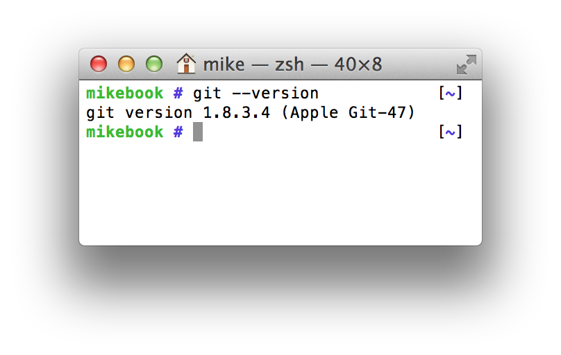
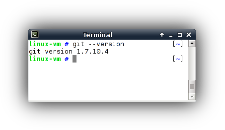
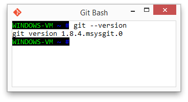
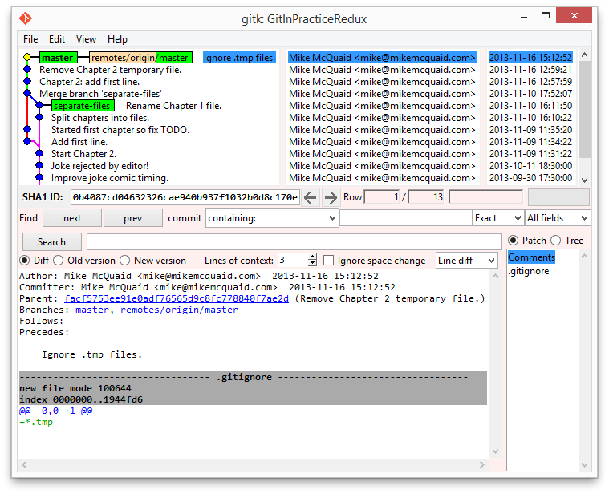
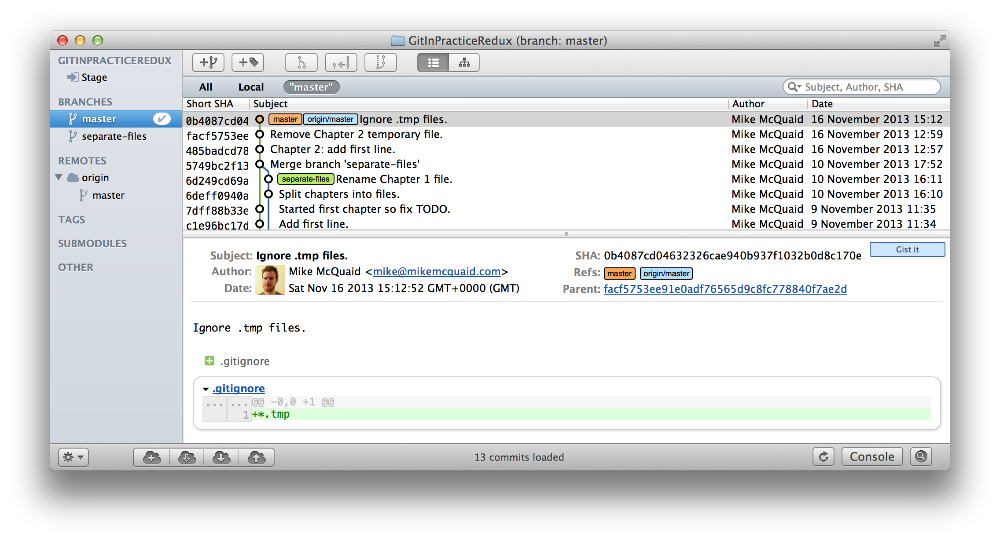

# Introduction to local Git
In this chapter you will learn how and why to use Git as a version control system on your local system by covering the following topics:
<!-- TODO: Bullets should either all be "How to..." or starting a "...ing" word (gerund) -->


* Why Git is popular with programmers
* How to install and use Git and gitk/GitX
* How to create a new local Git repository
* Committing to a Git repository
* Viewing the history of a Git repository
* Viewing the differences between Git commits/branches/tags

Git repositories store all their data on your local machine. This means when you create a new Git repository it does not need to send or receive any data from other computers in order to be useful. When you make commits, view history or request diffs these are all local operations that do not require a network connection. For these reasons Git is fast and can be used (and useful) for storing versions of files on your local machine.

<!-- TODO Why isn't section 2.1 in Chapter 1? This chapter is about "How?" rather than "Why?" -->

## Why do programmers use Git?
Git was originally created by programmers for programmers. Linus Torvalds, the creator of Git and the Linux kernel, started in 2008 with the goal of having a distributed, open-source, high-performance and hard to corrupt version control system for the Linux kernel project to use. Within a week Git was self-hosting (meaning Git's source code was hosted inside a Git repository) and within two and a half months the version 2.6.12 of the Linux kernel was made using Git.

From it's initial creation for the Linux kernel Git is now used by all sizes of companies, many open source projects and large "social coding" Git hosting sites such as GitHub or Bitbucket.

### Why is Git my preferred method of source control?
Git is my preferred method of software source code control (and even managing versions of text such as when I wrote this book). Git has many strengths over other methods of source control. Some of the reasons I personally prefer Git over the alternatives are:
<!-- TODO: First paragraph and bullets should be a callout -->

* Local. Git stores all of the history of a repository, branches and commits locally. Adding new versions or querying the history of a repository occurs locally rather than requiring a network connection. Compared to Subversion, for example, the history log or creating a branch is near-instant rather than sluggish (even over a fast connection)
* Speed. Git was written with a strong emphasis on performance. Combined with the local storage model means that many actions feel instant.
* Distributed. Related to "Local" above. As Git stores changes locally you are not constrained by the work of others when working in a team. Merge conflicts are solved at the time by the person doing the merge so you can continue your edit/commit workflow without interruptions.
* Rewriting history. In Git you can modify the history of branches (and even entire repositories). It's often useful to be able to make lots of small commits which are later turned into a single commit or make commit messages contain more information after the fact.
* Hard to lose data. With Git anything that is committed has a unique reference that survives rewriting or changes for at least 30 days. This means it's very hard to accidentally lose work.

Git's main downsides are the both the command-line application's interface and the documentation can be hard to follow; they sometimes rely on confusing jargon to explain concepts. To the credit of the Git community these have both improved vastly over the years. This book will sometimes seek to explain some of the concepts behind the jargon; this helps avoid understanding Git's interface but not what it is doing internally.

Despite these difficulties the strengths of Git have proved too strong for many software projects to resist. Google, Microsoft, Twitter, LinkedIn and Netflix all use Git as well as open-source projects such as the Linux kernel (the first Git user), Perl, PostgreSQL, Android, Ruby on Rails, Qt, GNOME, KDE, Eclipse and X.org.

Many of the above projects and many users of Git have also been introduced to Git and use it regularly through a Git hosting provider. My favourite is GitHub but there are alternatives such as Gitorious, Bitbucket, SourceForge, Google Code and others.

For now we'll focus on using Git locally which means we don't need access to a hosting service. Let's start by getting it installed.

## Installation
Git does not come pre-installed on most operating systems as it is a tool typically used by programmers rather than non-technical computer users. Let's install Git on your local machine. The method to do so varies depending on your operating system of choice.
<!-- TODO: note where/what automatically has Git installed and why diagrams below have different versions -->

### How to install and run Git on Apple OSX
<!-- TODO: Add OSX 10.9 instructions after release (22nd October?). -->


<!-- TODO: annotate diagram with sequence of actions -->
<!-- TODO: brew install git on 10.7+? -->
On OSX Lion (10.7) and above Git is provided with the Apple's Xcode Command Line Tools. You should install Xcode from the Mac App Store. After installing Xcode the Xcode Command Line Tools can be installed from inside Xcode by clicking through the menu bar options Xcode > Preferences > Downloads and selecting to install the Command Line Tools. After installation it should resemble Figure 2.1.

On OSX Snow Leopard (10.6) and below you can install Git from the official Git site at <http://git-scm.com/download/mac> or a package manager such as Homebrew/Tigerbrew (by running `brew install git`).

To run Git commands open a Terminal (either the default OSX `/Applications/Utilities/Terminal.app` or an alternative such as iTerm.app).



<!-- TODO: remove whitespace -->
With the Terminal open you can type in Git commands. To see what Git version you have installed type `git --version`. The output should resemble Figure 2.2.

### How to install and run Git on Linux or Unix
On Linux or Unix you can install Git directly from your package manager. How to do this varies from system to system but some of the popular options are below:

* Debian/Ubuntu: `apt-get install git`
* Fedora: `yum install git`
* Gentoo: `emerge --ask --verbose dev-vcs/git`
* Arch Linux: `pacman -S git`
* FreeBSD: `cd /usr/ports/devel/git && make install`
* Solaris 11 Express: `pkg install developer/versioning/git`
* OpenBSD: `pkg_add git`

To run Git commands open a Terminal application or console.



<!-- TODO: remove whitespace, black on white -->
With the Terminal open you can type in Git commands. To see what Git version you have installed type `git --version`. The output should resemble Figure 2.3.

### How to install and run Git on Microsoft Windows
Git for Windows can be downloaded from the official Git site at <http://git-scm.com/download/win>. Download and click through the installer (seen in Figure 2.4). When it has completed it will provide Start Menu links to run Git.

As Git is primarily a Unix program running Git on Windows will run a Unix shell which allows access to Git commands. This may be slightly scary but don't worry; this book will explain how to use any commands you'll need to use.

To run Git commands open the 'Git Bash' shortcut from the Start Menu. This will open a Unix shell in a Windows Command Prompt.



<!-- TODO: remove whitespace, black on white -->
With the Git shell open you can type in Git commands. To see what Git version you have installed type `git --version`. The output should resemble Figure 2.5.

### Gitk/GitX tools


<!-- TODO: annotate diagram and use same repo for gitk/gitx -->
gitk is a tool installed with Git for viewing the history of Git repositories. It is installed by default with Git on Windows and Mac but may need installed by your package manager on Linux. It's ability to graphically visualize Git's history is particularly helpful when history becomes more complex (e.g. with merges and remote branches). It can be seen running on Linux in Figure 2.6.

Alternatively there are various more attractive, up-to-date and platform-native alternatives to gitk. On Linux there are tools such as gitg for gtk+/GNOME (seen in Figure 2.7) integration and QGit for Qt/KDE integration. On OSX there are tools such as GitX (and various forks of the project).



<!-- TODO: annotate diagram and use same repo for gitk/gitx -->
As OSX is my platform of choice I'll be using screenshots of the GitX-dev fork (seen in Figure 2.8) of GitX to discuss history in this book. Don't worry about the contents of the screenshot for now; I'll discuss it further when you need.

## Creating a repository
Once you've installed Git the first thing you need to do to use it on your local machine is to create a Git repository. <!-- TODO: explain what a repo is e.g. a folder on disk that Git watches for you --> Typically you'd do this by downloading (known as _cloning_ by Git) another repository that already exists but let's create an empty, new local repository. <!-- TODO: and to do that we open a new terminal window... -->

### The git init command
A Git repository must be initialized before any files can be added, commits made or pushed elsewhere. When `git init` is run it creates a named directory (if passed; otherwise uses the current directory).

To create a new local Git repository in a new subdirectory named "git-testing":
<!-- TODO: use full OS paths to avoid confusion. Perhaps create repo in current directory instead  -->

1. Run `git init git-testing`
2. A new local Git repository has been created in a new subdirectory named "git-testing".

Under this directory a subdirectory named `.git` is created with various files and subdirectories under it.

<!-- TODO: annotate file listing -->
```
git-testing/.git/config
git-testing/.git/description
git-testing/.git/HEAD
git-testing/.git/hooks/applypatch-msg.sample
git-testing/.git/hooks/commit-msg.sample
git-testing/.git/hooks/post-update.sample
git-testing/.git/hooks/pre-applypatch.sample
git-testing/.git/hooks/pre-commit.sample
git-testing/.git/hooks/pre-push.sample
git-testing/.git/hooks/pre-rebase.sample
git-testing/.git/hooks/prepare-commit-msg.sample
git-testing/.git/hooks/update.sample
git-testing/.git/info/exclude
git-testing/.git/objects/info
git-testing/.git/objects/pack
git-testing/.git/refs/heads
git-testing/.git/refs/tags
```

The purpose of some of these files (seen in Listing 2.1) may be obvious to you if you have prior experience of version control. Git has created files for configuration, description (typically only used on repositories created for use on a server), various sample _hooks_ (scripts that run on defined events e.g. pre-commit is run before a new commit is made) and directories used for object storage and reference. If you remember in the previous chapter we discussed what branches and tags are. These are stored under the refs folder.

You shouldn't edit any of these files directly until you have a more advanced understanding of Git (or perhaps never at all). You will instead modify these files and folders by interacting with the Git repository through Git's commands <!-- TODO: reference later chapter where you'll do this -->.

## Committing changes to files
Like other version control systems to do anything useful in Git we first need one or more commits in our repository. To do this first requires adding files to Git's _index_.

### Git's index: a staging area for new commits


<!-- TODO: add more annotations to diagram e.g. "Add changes and new files to index", "Commit files from index to repo", "Retrieve current set of files from repo to local"????? -->
Git's index is a staging area used to build up new commits. Rather than requiring all changes in the working tree make up the next commit Git allows files (and even lines within files) to be added incrementally to the index. The add/commit workflow can be seen in Figure 2.9. <!-- TODO: another diagram showing building from the index into multiple new commits -->

Git does not add anything to the index without your instruction. As a result, the first thing you have to do with a file we want to include in a Git repository is request Git to add it to the index.

### The git add command: adding files to the index
To add an existing file 'README.md' to the index:

1. Change directory to the Git repository (e.g. `cd ~/git-testing/`)
2. Ensure the file 'README.md' is in the current directory.
2. Run `git add README.md`
3. The file 'README.md' has been added to the index.

When a file is added to the index a file named `.git/index` is created (if it does not already exist). The added file contents and metadata are then added to the index file. You have requested two things of Git here:

1. for Git to track the contents of the file as it changes (this is not done without an explicit `git add`)
2. the contents of the file when `git add` was run should be added to the index, ready to create the next commit.

Note that as the file is changed the contents of the commit will not be updated to reflect these changes without another `git add`. This may appear strange; why would you not want to add new changes to the next commit? Later in the book <!-- TODO: where? --> this approach of incrementally and explicitly constructing new commits will be used to create a more readable version control history.

Now that the contents of the file have been added to the index we're ready to make a new commit.

### The git commit command: adding a new commit to the repository
To commit the contents of an existing file 'README.md':

1. Change directory to the Git repository (e.g. `cd ~/git-testing/`)
2. Ensure the file 'README.md' is in the current directory.
3. Run `git add README.md`
4. Run `git commit`
5. A text editor will open requesting a commit message. Enter a description of what you have changed, save the file and close the text editor.
6. The new commit containing 'README.md' has been added to the repository.

<!-- TODO: Technically, step 6 isn't a step. It's the text that should be after the list. Also, you might want to split it into Steps 1 to 3 and then a separate list of steps 4 to 5 which does the actual commit.

Also, on reflection of this list, it might be wise if there's a full listing of the git add, git commit, and resposne so the reader can see it in full with a few annotations, adn then figure 2.10. Currently figure 2.10 is a little orphaned because there's no context for the commit subject.... -->


<!-- TODO: what's create mode? Any other modes? -->
The output of `git commit` can be seen in Figure 2.10. To expand on the annotations in this diagram:

* 'branch'. The branch on which the commit was made. The default branch in Git is master so that is what is shown here (as you never explicitly created a branch).
* 'root'. As this was the first commit in the repository it is known as the 'root commit' or 'initial commit'. This means it has no parent commit.
* 'shortened SHA-1'. Every commit in Git is given a unique 40 hexadecimal character SHA-1 hash <!-- TODO: what is a SHA-1 hash? Add footnote --> based on the contents and metadata of that commit. As these are rather unwieldy Git will often show shortened versions (as long as they are unique in the repository). Anywhere that Git accepts a SHA-1 unique commit reference it will also accept the shortened version.
* 'commit subject'. The commit message you entered is structured like an email. The first line of it is treated as the subject and the rest as the body. The commit subject will be used as a summary for that commit when only a single line of the commit message is shown.
* 'changed files count'. On a new commit Git will always show how many files were added, modified or deleted in the commit. In this case I added one file (README.md).
* 'changed lines count'. On a new commit Git will also show how many lines were added, modified or deleted across all the files in the commit. In this case I added one new file with three new lines.
* 'new file permissions'. This is the file mode for the newly created file. These are related to Unix file permissions and the `chmod` command but are not important in understanding how Git works so can be safely ignored.
* 'new filename'. This shows what filenames that have been added or deleted in this commit.

Let's see the output when modifying the contents of the `README.md` file and and adding an empty `LICENSE.md`.


There are a few changes in Figure 2.11 from Figure 2.10:

* No 'root commit' is shown as this is the second, non-root commit which has the root commit as its parent.
* 'shortened SHA-1'. As this is a new commit the SHA-1 differs from the root commit.
* 'changed files count'. One file was modified and another was added so this shows two files.
* 'changed lines count'. Two lines were modified in README.md but LICENCE.md was unchanged. This shows two insertions and two deletions because Git treats the modification of a new line as the deletion of an old line and insertion of a new one.
* 'new filename'. LICENSE.md has been added so is shown but README.md was added in the root commit so is not.

Now that we have two commits we can start looking at Git's history.

## History
Git's history stores the graph of all commits in the repository. Viewing it is useful for working out where you are in terms of branches and previous commits.

The first command you will use to navigate history is `git log`.

### The git log command: viewing the history
To view the commit history (also known as log):

1. Change directory to the Git repository (e.g. `cd ~/git-testing/`)
2. Run `git log`

```
commit 69664f87db4f5b51e1ae64a38e6696fb2a7ed9e1
Author: Mike McQuaid <mike@mikemcquaid.com>
Date:   Sat Oct 12 14:36:01 2013 +0100

    Change stability and add empty LICENSE.

commit a10d9af146e67ecabb078e91f17913c24363ee63
Author: Mike McQuaid <mike@mikemcquaid.com>
Date:   Sat Oct 12 14:00:34 2013 +0100

    Add new markdown README file.

    This will help people understand what this repository is for.
```

<!-- TODO: perhaps add in the original command for context? Also: annotate more. -->
The commit log (seen in Listing 2.2) lists all the commits that have been made on the current branch in reverse chronological order. You can see the two commits that were made in the previous section and how they are represented by Git. The 'commit' lists the full 40 character SHA-1 (that is sometimes shown abbreviated). The author is the person who created the commit's name and email address. The date is the time the commit was created. The additional text is the commit message; the first line is the commit message subject and the rest the commit message body.

It's also helpful to visualize the history graphically.

### Viewing history with gitk/GitX tools
To view the commit history with gitk or GitX:

1. Change directory to the Git repository (e.g. `cd ~/git-testing/`)
2. Run `gitk` or `gitx`


<!-- TODO: annotate GitX -->
The GitX history (seen in Figure 2.12) shows similar output to `git log` but in a different format. You can also see the current branch and the contents of the current commit including the diff, parent SHA-1 and a Gravatar image (obtained from the commit author's email address).

Querying the differences between any two commits can be useful so let's learn how to do that.

## Diffs: differences between commits
You learnt in the previous chapter that diffs are the differences between two commits. In Git we are able to reference commits using various references (known by Git as _refs_). <!-- TODO: git diff command example -->

### Git refs: different references for individual commits
In Git _refs_ are the various possible ways of addressing individual commits <!-- TODO: when/why would they be used? -->. A SHA-1 (shortened or the full 40 characters) is a unique reference to a commit. What about other ways of referencing a commit?

The first you have already seen is by the branch (which is 'master' by default if you haven't created any other branches). If you remember from the previous chapter, branches are actually pointers to a specific commit. Therefore referencing the SHA-1 of commit at the top of the master branch (the short version from the last example being `69664f87`) is the same as referencing the branch name 'master'.


<!-- TODO: needs better annotations to tie into the text -->
<!-- TODO: use same format for this diagram and workflow as others e.g. remote colors, fix font sizes etc. -->
The second is 'HEAD'. The 'HEAD' always points to the top of whatever you have currently checked out so will typically be the top commit of the current branch you are on. Therefore if you have the master branch checked out then 'master' and 'HEAD' are equivalent. See the master/HEAD pointers demonstrated in Figure 2.13.

The third is a tag. Tags are very similar to branches in Git but don't update as branches do when you make more commits on top of them. We'll discuss tags more in the next chapter.

There are more types (such as remote references) but you don't need to worry about them just now.

Refs can also have modifiers appended. Suffixing a ref with `^` is the same as saying 'the commit before that ref'. For example 'HEAD^' is the commit before the currently checked out commit and 'master^' is the penultimate commit on the master branch. Another modification allows you to specify the number of commits to look before. 'HEAD~2' is two commits before the currently checked out branch. Note that 'HEAD^' and 'HEAD~1' are equivalent.

Now that you know various ways to reference commits lets see how to query the differences between two commits.

### The git diff command
The `git diff` command allows you to query the differences between two commits (or refs).

To see the diff between the current state of the working directory and the penultimate commit:

1. Change directory to the Git repository (e.g. `cd ~/git-testing/`)
2. Run `git diff HEAD^`


<!-- TODO: more annotations, better title/caption -->
The `git diff` output (seen in Figure 2.14) contains some similar elements to the `git commit` or `gitx` output we looked at earlier. You can see the new and modified filenames, the file mode and deleted and inserted lines. Don't worry about the 'index' lines; they are not important in understanding diff output.

The most interesting part of the diff are the changes that are made to the files. You can see that `LICENSE.md` had no changes made to it (just the creation of the empty file). `README.md` had two lines modified (shown as deleted and then inserted) and one line ('Mike McQuaid') left unchanged.

These changes indicate the differences between the two states we requested: the commit before HEAD and the (implicitly requested) current state of the working tree.

We could request the difference between the last committed revision and the previous revision by providing two arguments to `git diff`:

1. Change directory to the Git repository (e.g. `cd ~/git-testing/`)
2. Run `git diff HEAD HEAD^`

```
diff --git a/LICENSE.md b/LICENSE.md
new file mode 100644
index 0000000..e69de29
diff --git a/README.md b/README.md
index cab9b27..73e1115 100644
--- a/README.md
+++ b/README.md
@@ -1,3 +1,3 @@
-Please use this software it is very stable.
-Thanks!
+Please do not use this software it is very unstable.
+Sorry!
 Mike McQuaid
```

This time because we specified `HEAD` followed by `HEAD^` we see the changes in Listing 2.3 from HEAD to the commit before HEAD; as if the changes in that commit were applied in reverse.

## Summary
In this chapter you hopefully learned:

* Git is a good version control system for programmers as it is local, fast, distributed, allows rewriting history and it is hard to lose data while using it.
* Install and run Git on Apple OSX, Linux and Microsoft Windows.
* Create a new local repository using `git init`.
* Add files to Git's index staging area using `git add`.
* Commit files to the Git repository using `git commit`.
* View history using `git log` and `gitk`/`gitx`.
* How to use refs to reference commits and their ancestors.
* See the differences between commits using `git diff`.

Now let's learn how to use these concepts to interact with repositories that are not stored on your local machine.
